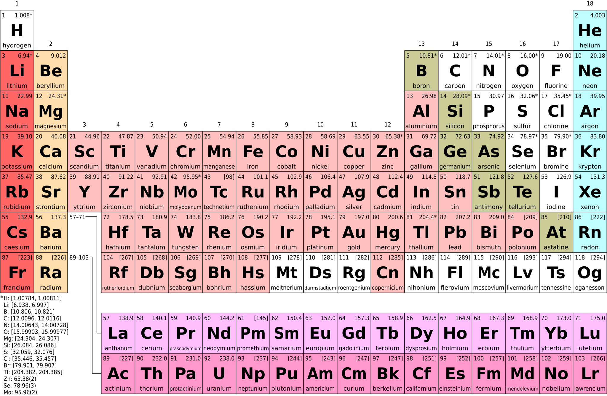

# Khan - College Chemistry

## Unit 1: Atomic structure and properties

These are notes for [Unit 1: Atomic structure and properties](https://www.khanacademy.org/science/ap-chemistry-beta/x2eef969c74e0d802:atomic-structure-and-properties) as part of the Khan Academy's [AP®︎/College Chemistry](https://www.khanacademy.org/science/ap-chemistry-beta) course.

### Lesson 01: Moles and molar mass

--- --- ---
<!--note::1-->
A ***<!--c1::-->dalton (Da)***, previously a ***<!--c2::-->unified atomic mass unit (u)***, is a unit of mass defined as ⁠$1 / 12$⁠ of the mass of an unbound neutral atom of carbon-12 in its nuclear and electronic ground state and at rest. Since carbon-12 has six protons and six neutrons (that are roughly the same size and some electrons that are of negligible size) then this value is useful for molecular calculations. The value is roughly equivalent to $1.660540 \times 10^{-27}\text{kg}$.

--- ---
--- --- ---
<!--note::2-->
An ***<!--c1::-->isotope*** of an ***<!--c2::-->element*** has the same number of protons but a different number or neutrons. The number of protons establishes the chemical behaviour so these are all the same ***<!--c2::-->element***.
--- ---
--- --- ---
<!--note::3-->
The ***<!--c1::-->[relative atomic mass](https://en.wikipedia.org/wiki/Relative_atomic_mass)
($A_r$)***, previously the atomic weight, of a given element is the weighted arithmetic mean of the masses of the individual atoms (including all its isotopes) that are present in the sample.
--- ---
--- --- ---
<!--note::4-->
The ***<!--c1::-->[standard atomic weight](https://en.wikipedia.org/wiki/Standard_atomic_weight)*** is a ***<!--c2::-->[relative atomic mass](https://en.wikipedia.org/wiki/Relative_atomic_mass)*** where the sample is representative of a sample on Earth. It is defined by the [Commission on Atomic Weights and Isotopic Abundances](https://en.wikipedia.org/wiki/Commission_on_Isotopic_Abundances_and_Atomic_Weights). This is printed on periodic tables using the unit daltons.
--- ---
--- --- ---
<!--note::5-->
One ***<!--c2::-->[mole](https://en.wikipedia.org/wiki/Mole_(unit))*** is an ***<!--c1::-->[Avogadro's number](https://en.wikipedia.org/wiki/Avogadro_constant)*** of particles. Rounded, this is $6.022 \times 10^{23}$ particles. Its weight in grams will be the sum of the ***<!--c3::-->[relative atomic masses](https://en.wikipedia.org/wiki/Relative_atomic_mass)*** of a single particle.
--- ---
--- --- ---
<!--note::6-->
It's convenient to work with numbers of particles in chemical equations but these would be in very large numbers. To handle this, the ***<!--c1::-->[mole](https://en.wikipedia.org/wiki/Mole_(unit))*** is used.
--- ---
--- --- ---
<!--note::7-->
The ***<!--c1::-->molecular mass*** is the mass of a given molecule, usually expressed in units of daltons (Da).

The ***<!--c2::-->molar mass*** is defined as the mass in grams of 1 mol of that substance, measured in g/mol. This is the sum of the ***<!--c3::-->[relative atomic masses](https://en.wikipedia.org/wiki/Relative_atomic_mass)*** multiplied by the ***<!--c4::-->[molar mass constant](https://en.wikipedia.org/wiki/Molar_mass_constant)*** (effectively multiplying by 1 g/mol) This is usually very close to the ***<!--c1::-->molecular mass*** value but can be different if the sample includes different isotopes.
--- ---
--- --- ---
<!--note::8-->
What is the the molar mass of $\text{CH}_4$?.

The standard atomic weights are:

- H: 1.008
- C: 12.011

---
$12.011 + 4 \times 1.008 = 16.043 \text{ g/mol}$

--- ---

> **Note**: Everything below this point might be for a later lesson.

--- --- ---
<!--note::9-->
Balance the equation below:

$\text{CH}_4 + \text{O}_2 \rightarrow \text{CO}_2 + \text{H}_2\text{O}$

---

$\text{CH}_4 + 2\text{O}_2 \rightarrow \text{CO}_2 + 2\text{H}_2\text{O}$

--- ---
--- --- ---
<!--note::10-->

How many moles of carbon dioxide are produced when 32.0 grams of oxygen are consumed while burning methane?

$\text{CH}_4 + 2\text{O}_2 \rightarrow \text{CO}_2 + 2\text{H}_2\text{O}$

The standard atomic weights are:

- O: 16.00

---
$\frac{1}{2} \text{ mol}$
--- ---
--- --- ---
<!--note::11-->

How many grams of water will be produced when $\frac{1}{2}$ mole of methane burns completely?

$\text{CH}_4 + 2\text{O}_2 \rightarrow \text{CO}_2 + 2\text{H}_2\text{O}$

The molar masses are:

- H: 1.008 g/mol
- O: 16.00 g/mol

---
18.016 grams
--- ---
--- --- ---
<!--note::12-->
How many molecules in 19 grams of florine (f)?

Constants:

- standard atomic weight for F: 19.0
- Avogadro's number: $6.022 \times 10^{23}$

---

$ 19 \div 19 \times 6.022 \times 10^{23} = 6.022 \times 10^{23}$
--- ---

### Lesson 02: Mass spectrometry of elements

### Lesson 03: Elemental composition of pure substances

### Lesson 04: Composition of mixtures

### Lesson 05: Atomic structure and electron configuration

### Lesson 06: Periodic trends

### Lesson 07: Valence electrons and ionic compounds

### Lesson 08: Photoelectron spectroscopy
